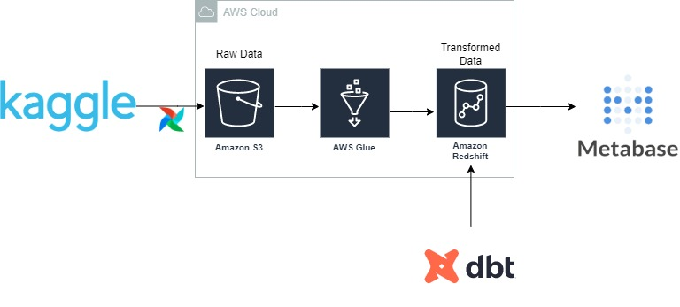
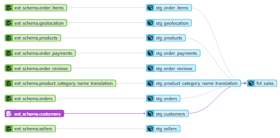
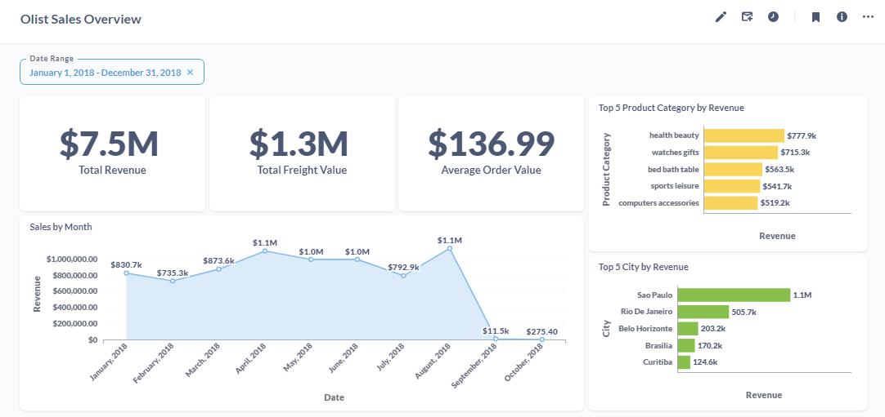

# Brazilian E-Commerce Project

The repository contains the final project for the [Data Engineering Zoomcamp by DataTalksClub](https://github.com/DataTalksClub/data-engineering-zoomcamp). 

## Project description

Olist is an operator of an online e-commerce platform. The platform connects entrepreneurs with major online retailers and allows them to advertise and sell in the marketplace without complication, enabling retail companies to reach out to the international marketplaces, improve the shopping experience and modify their purchasing behavior.

The aim of the project is to provide a visual representation of main sales metrics for Olist's sellers and managers. Using it can help reduce the amount of time spent on manual compilation of the report and analyze sales data more effectively.

See [INSTALL.md](INSTALL.md) for some installation instractions.

## Data source

The dataset of Brazilian E-Commerce was taken from kaggle.com - [Brazilian E-Commerce Public Dataset by Olist](https://www.kaggle.com/datasets/olistbr/brazilian-ecommerce). It has information of 100k orders from 2016 to 2018 made at multiple marketplaces in Brazil. Its features allows viewing an order from multiple dimensions: from order status, price, payment and freight performance to customer location, product attributes and finally reviews written by customers. A geolocation dataset relating Brazilian zip codes to lat/lng coordinates was also released.

## Architecture diagram

## Technologies

* Cloud: AWS
    * Data lake: S3
    * Data warehouse: Redshift
* Data transformation: dbt
* Data orchestration: Apache Airflow
* Data visualization: Metabase

## Notes

### Data warehouse

Tables were created in Redshift. To improve query performance in Redshift can be used distribution and sort keys. A distribution key defines where (specific node, its slice) data is stored in Redshift. Sort key determines the order in which rows are stored. [AWS recommended](https://docs.aws.amazon.com/redshift/latest/dg/t_Sorting_data.html) that we create your tables with SORTKEY AUTO (default value). If you do so, then Amazon Redshift uses automatic table optimization to choose the sort key. For this reason, the distribution keys are also set by default, as after convertin to parquet the dataset is small (54M) and we won't see the significant improvment in performance.

### Transformations

Transformations in data warehouse were defined with dbt. As a result, 3 schemas were created: staging, dbt_schema and production. Firstly, the raw data from AWS S3 is uploaded to the staging schema as is. Then, after small transformations, it is loaded into dbt_schema (for development) or pruduction (for deployment). The data lineage is shown below:

The dbt scripts are in the [dbt_test-main](dbt).

### Dashboard

The Olist Sales Overview dashboard shows key sales metrics. Total revenue for 2018 was USD 7.5 million and an average order value was approximately of USD 137. However, we see a drop in sales in September and October. This may be due to the fact that Olist didn't publish this data on kaggle.com.